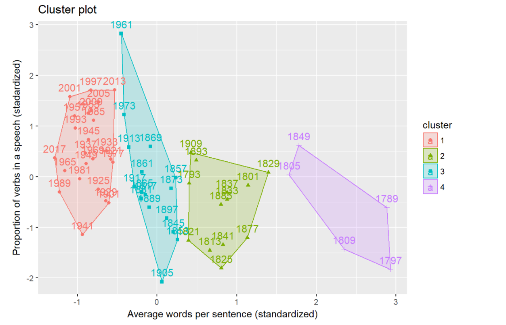

# Spring 2018
# Project 1: The change of talking style over time and the difference between two Parties of American Presidents' inauguration speeches.

### [Project Description](doc/)
This is the first and only *individual* (as opposed to *team*) this semester.  

Term: Spring 2018

+ Projec title: **The change of talking style over time and the difference between two Parties of American Presidents' inauguration speeches.**
+ This project is conducted by **Jingtian Yao** *(jy2867)*

+ Project summary: In this project, I want to figure out that whether there exists any significant change in the talking style of American Presidents' inauguration speeches over time. If it does, we are willing to give reasonable explanations to those phenomena. I also want to find difference between the talking style of Republican and Democratic.

The following is the abstract of this project.

*Part I: Data Processing*

In this part, we process the inauguration speeches text and make some data cleaning for further analysis.

*Part II: Data Analysis*

In theis part, we focus on the average lenth of sentences/ verbs/ sentiments in each speech and figure out whether there exists any significant changing pattern over time.

*Part III: Conclusion*

In this part, we state the conclusions obtained from the previous analysis.


+ Reference:
  1. wk2-Tutorial-TextMining.Rmd, Prof. Ying Liu, Chengliang Tang
  2. InteractiveWordCloud.Rmd, Prof. Ying Liu, Chengliang Tang

Following [suggestions](http://nicercode.github.io/blog/2013-04-05-projects/) by [RICH FITZJOHN](http://nicercode.github.io/about/#Team) (@richfitz). This folder is orgarnized as follows.

```
proj/
├── libs/
├── data/
├── doc/
├── figs/
└── output/
```

Please see each subfolder for a README file.

## Important Outcomes

+ The average length of sentences has an significant decreasing trend over time.


Making a scatter plot and appling linear regression to the data, the decreasing tendency of number of words per sentence in the presidents’ inauguration speech is confirmed.


+ The average proportion of verb used in each speech by Democratic is larger than that by Republican.


+ Computing the frequency of verbs used by Republican and Democratic Presidents, we get the word clouds for two Parties.


+ Both 2 Parties have some unique verbs that are not frequently used by the other one.


+  The proportion of verbs in the inauguration speech has an increasing tendency over time.


+ Besides “negative” and “positive” sentiments, top 3 sentiments in all Presidents' speeches are “trust”, “anticipation” and “joy”.


+ There is no significant difference among the degree of positive sentiment in all the presidents’ speeches.


+ Making clustering analysis based on the two indexes, “Average words per sentence” and “proportion of verbs in a speech” are two good indexes that could “measure” the change of talking style of Presidents over time to some extent.


